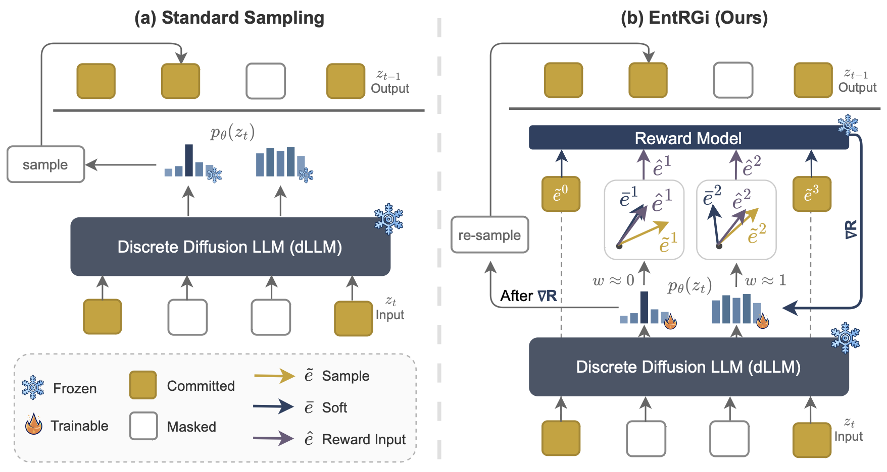

# EntRGi: Entropy Aware Reward Guidance for Diffusion Language Models

<p align="center">
  <a href="https://atutej.github.io/entrgi/"></a>
  <a href="https://arxiv.org/abs/2602.05000"></a>
  <a href="https://github.com/atutej/entrgi"></a>
</p>

<p align="center">
  
</p>

## Overview

**EntRGi** (Entropy-aware Reward Guidance) is a method for steering discrete diffusion language models at inference time using reward model feedback. Our key insight is to dynamically interpolate between soft embeddings and hard tokens based on the model's predictive entropy—balancing the fundamental tension between gradient accuracy and reward model reliability.

### Key Features

- **Entropy-aware interpolation**: Automatically adjusts the soft-hard embedding mix based on model confidence
- **Inference-time steering**: No fine-tuning required, can directly be applied on a dLLM
- **Reward model agnostic**: Compatible with standard autoregressive reward models
- **Improved generation rewards**: Achieves higher rewards while maintaining text coherence

## Installation

```bash
git clone https://github.com/atutej/entrgi.git
cd entrgi

# Install dependencies
pip install torch transformers accelerate datasets
pip install vllm  # For LMUnit evaluation

# Install Dream model
pip install dream-model  # or clone from source
```

### Requirements

- Python 3.10+
- PyTorch 2.0+
- CUDA 11.8+ (for multi-GPU training)
- 4x A100 80GB GPUs (recommended)

## Quick Start

### Running EntRGi

```bash
cd main_expts

# Run EntRGi on a single prompt
python entrgi.py \
    --K 4 \
    --M 3 \
    --eta 0.5 \
    --T 128 \
    --temperature 0.7 \
    --use_entrgi \
    --reward_model "Skywork/Skywork-Reward-V2-Qwen3-1.7B" \
    --dataset_path "THU-KEG/RM-Bench" \
    --split train \
    --prompt_field prompt \
    --output_file results/entrgi_results.json
```

### Running Baselines

```bash
# Best-of-N (BoN) baseline
python bon.py \
    --K 4 \
    --T 128 \
    --temperature 0.7 \
    --reward_model "Skywork/Skywork-Reward-V2-Qwen3-1.7B" \
    --dataset_path "THU-KEG/RM-Bench" \
    --output_file results/bon_results.json

# APS (Straight-Through Estimator)
python entrgi.py \
    --K 4 --M 3 --eta 0.5 --T 128 \
    --use_aps \
    --reward_model "Skywork/Skywork-Reward-V2-Qwen3-1.7B" \
    --output_file results/aps_results.json

# Expectation (Continuous Relaxation)
python entrgi.py \
    --K 4 --M 3 --eta 0.5 --T 128 \
    --reward_model "Skywork/Skywork-Reward-V2-Qwen3-1.7B" \
    --output_file results/expectation_results.json
```

### Multi-GPU Inference

```bash
# Run with 4 GPUs using torchrun
CUDA_VISIBLE_DEVICES=0,1,2,3 torchrun --nproc_per_node=4 --master_port=29500 entrgi.py \
    --K 4 --M 3 --eta 0.5 --T 128 \
    --use_entrgi \
    --batch_size 4 \
    --reward_model "Skywork/Skywork-Reward-V2-Qwen3-1.7B" \
    --dataset_path "THU-KEG/RM-Bench" \
    --output_file results/entrgi_results.json
```

### Full Experiment Suite

```bash
# Run all methods on all datasets
bash run.sh
```

## Evaluation

### LMUnit Evaluation

Evaluate generated responses using [LMUnit](https://huggingface.co/ContextualAI/LMUnit-qwen2.5-72b):

```bash
python lmunit_eval.py \
    --file results/entrgi_results.json \
    --output results/lmunit_results/entrgi_eval.json \
    --model ContextualAI/LMUnit-qwen2.5-72b \
    --tp_size 4
```

### Aggregate Results

```bash
python aggregate_results.py ./results

# Filter by temperature
python aggregate_results.py ./results --temperature 0.7

# Filter by method
python aggregate_results.py ./results --methods entrgi bon
```

## Hyperparameters

| Parameter | Description | Default |
|-----------|-------------|---------|
| `K` | Number of parallel trajectories | 4 |
| `T` | Total diffusion denoising steps | 128 |
| `M` | Gradient optimization steps per denoising step | 3 |
| `η` (eta) | Learning rate for logit optimization | 0.5 |
| `τ` (temperature) | Sampling temperature | 0.7 |
| `max_new_tokens` | Maximum generation length | 128 |

## Datasets

We evaluate on three reward model benchmarks:

| Dataset | Split | Prompt Field | Description |
|---------|-------|--------------|-------------|
| [RM-Bench](https://huggingface.co/datasets/THU-KEG/RM-Bench) | train | prompt | Reward model benchmark |
| [JudgeBench](https://huggingface.co/datasets/ScalerLab/JudgeBench) | gpt | question | Judge model benchmark |
| [Reward-Bench-2](https://huggingface.co/datasets/allenai/reward-bench-2) | test | prompt | Reward model benchmark v2 |

## Models

### Diffusion Model
- [Dream-v0-Instruct-7B](https://huggingface.co/Dream-org/Dream-v0-Instruct-7B)

### Reward Models
- [Skywork-Reward-V2-Qwen3-0.6B](https://huggingface.co/Skywork/Skywork-Reward-V2-Qwen3-0.6B)
- [Skywork-Reward-V2-Qwen3-1.7B](https://huggingface.co/Skywork/Skywork-Reward-V2-Qwen3-1.7B)
- [Skywork-Reward-V2-Qwen3-4B](https://huggingface.co/Skywork/Skywork-Reward-V2-Qwen3-4B)

## Metrics

| Metric | Description |
|--------|-------------|
| **Top@1** | Maximum reward achieved across K trajectories |
| **Avg@N** | Average reward across all K trajectories |
| **LMUnit** | Quality score from LMUnit judge model (1-5 scale) |

## Project Structure

```
entrgi/
├── main_expts/
│   ├── entrgi.py          # Main EntRGi/APS implementation
│   ├── bon.py             # Best-of-N baseline
│   ├── utils.py           # Shared utilities and config
│   ├── lmunit_eval.py     # LMUnit evaluation script
│   ├── aggregate_results.py  # Results aggregation
│   └── run.sh             # Full experiment runner
├── images/
│   └── method.png         # Method overview figure
└── README.md
```

## Citation

```bibtex
@article{tejaswi2026entrgi,
  title   = {EntRGi: Entropy Aware Reward Guidance for Diffusion Language Models},
  author  = {Tejaswi, Atula and Rout, Litu and Caramanis, Constantine and 
             Shakkottai, Sanjay and Sanghavi, Sujay},
  journal = {arXiv preprint arXiv:2602.05000},
  year    = {2026}
}
```

## Acknowledgments

This work builds on:
- [APS](https://arxiv.org/abs/2510.02291) - Test-Time Anchoring for Discrete Diffusion Posterior Sampling
- [Dream](https://github.com/Dream-org/Dream) - Discrete diffusion language model
- [Skywork-Reward](https://huggingface.co/Skywork) - Reward models
- [LMUnit](https://huggingface.co/ContextualAI/LMUnit-qwen2.5-72b) - Evaluation model